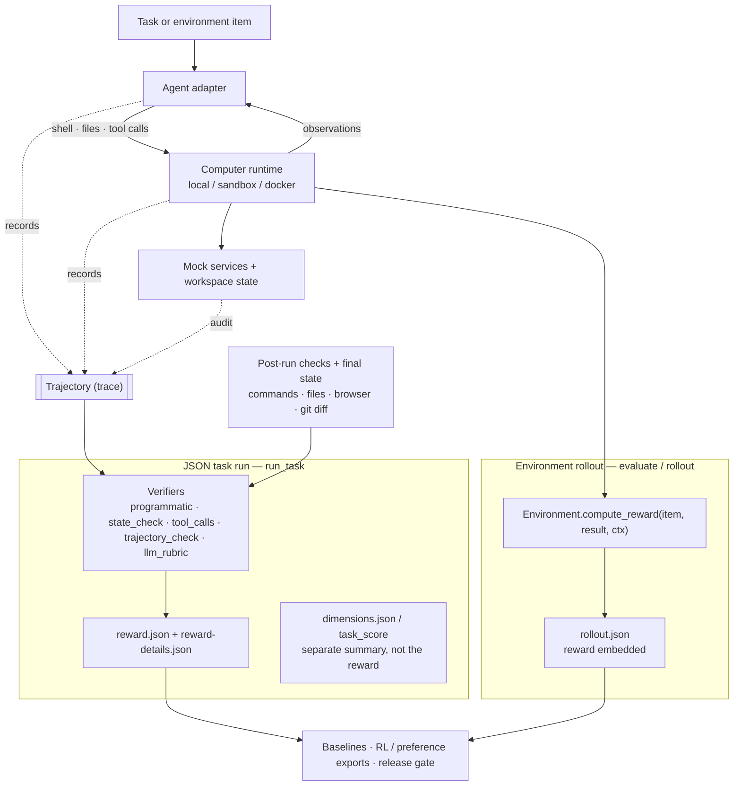

# Agentic Evals

`agenticevals` is a framework for evaluating AI agents by the work they actually do.

It records the full loop:

```text
task -> agent turns -> actions -> observations -> final state -> reward
```

The goal is to evaluate whether an agent can move from user intent to valid actions, observed state changes, recovery when needed, and a useful final artifact.

<div align="center">



</div>

## Quick Start

```bash
python3 -m unittest discover -s tests
python3 -m agenticevals run configs/tasks/patch-python-bug.json
python3 -m agenticevals evaluate examples.agent_smoke_env:AgentSmokeEnv --agent scripted --max-items 10 --backend local
```

Run a suite:

```bash
python3 -m agenticevals suite configs/suites/agentic-core.json --workers 2
python3 -m agenticevals review runs/<suite-run-dir> --filter status=failed
```

Run repeated trials for pass^k:

```bash
python3 -m agenticevals run configs/tasks/mock-gmail-draft.json --agent scripted --trials 3
```

## What It Measures

An agentic eval should inspect more than the final message. `agenticevals` captures:

- the user-facing task
- the agent's messages and tool/action attempts
- tool results and environment observations
- files, services, browser state, or other state changed by the agent
- verifier evidence
- reward components
- final artifact and completion status

This makes failures inspectable: wrong tool, invalid arguments, forbidden file edits, early stopping, unsafe action, loop, missing artifact, or incorrect final state.

## Core Primitives

- **Tasks** describe the instruction, workspace, tools, limits, verifiers, and scoring contract.
- **Environments** generate task items and compute rewards over real state.
- **Agents** can be scripted, CLI-backed, provider-native, HTTP-backed, or model-loop based.
- **Backends** provide the computer interface: local process, sandbox HTTP, or Docker isolation.
- **Verifiers** produce `reward.json` and `reward-details.json` from programmatic checks, state checks, tool-call checks, trajectory checks, and LLM rubrics.
- **Trajectories** are emitted as raw `trajectory.jsonl` and typed `trajectory.json`.
- **Suites** run many tasks with parallel execution, checkpoint resume, result summaries, and failure clustering.

## Example Tasks

Run a coding task with a hidden grader:

```bash
python3 -m agenticevals run configs/tasks/code-hidden-grader.json
```

Run a mock-service task with an audit log:

```bash
python3 -m agenticevals run configs/tasks/mock-gmail-draft.json --agent scripted
```

Run a browser-visible state task:

```bash
python3 -m agenticevals run configs/tasks/browser-state.json
python3 -m agenticevals rollout examples.browser_state_env:BrowserStateEnv --agent scripted --backend local
```

Run the deterministic smoke environment:

```bash
python3 -m agenticevals evaluate examples.agent_smoke_env:AgentSmokeEnv --agent scripted --max-items 10 --backend local
python3 -m agenticevals evaluate examples.agent_smoke_env:AgentSmokeEnv --agent noop --max-items 10 --backend local
```

## Agent Adapters

CLI-account adapters:

```bash
AGENTICEVALS_CODEX_COMMAND="codex exec --skip-git-repo-check --sandbox workspace-write --cd {workspace} {prompt}"
AGENTICEVALS_CLAUDE_COMMAND="claude -p --permission-mode acceptEdits --add-dir={workspace} {prompt}"
```

Provider-native adapters:

```bash
OPENAI_API_KEY=""
ANTHROPIC_API_KEY=""
GEMINI_API_KEY=""
GOOGLE_API_KEY=""
```

Check adapter availability:

```bash
python3 -m agenticevals adapters
python3 -m agenticevals verify-adapters
```

## Baselines

Generate local baseline artifacts for a suite:

```bash
python3 -m agenticevals baselines configs/suites/core.json --agents scripted,noop,model-loop --workers 2
```

Generate local baseline artifacts for an environment:

```bash
python3 -m agenticevals env-baselines examples.tau_retail_env:TauRetailEnv --agents scripted,noop --max-items 3 --trials 2
```

Baseline artifacts include pass@1, pass^k, confidence intervals, and cost-per-success when the adapter exposes token/cost accounting. Proportion metrics (`pass_rate`, `pass_at_1`, `pass_power_k`) use a **Wilson score interval**, which stays non-degenerate at 0%/100% where a percentile bootstrap collapses to zero width; continuous metrics keep bootstrap CIs. `pass^k` is the unbiased `C(c,k)/C(n,k)` estimator. A `saturated` flag marks suites where every agent lands at the same extreme (no discriminative signal).

## Judge Calibration & Release Gating

LLM-judge verifiers (`llm_rubric`) return a reason-first **binary verdict**. Useful per-rubric config keys:

- `rubric`: the grading instruction.
- `threshold`: pass threshold when only a `score` is returned (default `0.5`).
- `repetitions`: judge the trajectory N times and majority-vote (ties break on mean score), surfacing variance a single cached call hides.
- `transcript_max_chars` / `transcript_max_steps`: how much trajectory the judge sees (default 500 chars/step).
- `provider` / `model` / `timeout` / `max_tokens`.

Validate a judge before trusting its scores:

```bash
# 1. Sample real judge decisions from runs into a balanced labeling template
python3 -m agenticevals make-calibration-set runs/<suite-run-dir> -o labels.jsonl --size 100
# 2. Fill in human_passed for each row, then compute agreement
python3 -m agenticevals calibrate-judge labels.jsonl
# 3. Gate a release on baselines + judge agreement
python3 -m agenticevals release-gate --baselines runs/<baselines-dir>/baselines.json --calibration labels.calibration.json
```

The calibration report includes accuracy, Cohen's kappa, and per-class **TPR/TNR**. The release gate enforces kappa, TPR/TNR (≥0.70 when present), a minimum labeled-sample size, and rejects a saturated baseline.

## Data Export

```bash
python3 -m agenticevals export-data runs/<run-dir> --format rl
python3 -m agenticevals export-data runs/<suite-or-trial-run-dir> --format preferences
python3 -m agenticevals export-dataset runs/<suite-or-trial-run-dir>
python3 -m agenticevals recompute-rewards runs/<task-run-dir>
python3 -m agenticevals improve-loop runs/<suite-or-trial-run-dir>
```

Exports support stable trajectory rows, grouped rollouts, preference pairs, hard negatives, reward recomputation, dataset manifests, and dataset cards.

## Isolation

Use Docker when the task needs stronger process/filesystem isolation:

```bash
python3 -m agenticevals evaluate examples.patch_python_bug_env:PatchPythonBugEnv \
  --agent scripted \
  --max-items 1 \
  --backend docker \
  --image auto
```

Use the persistent sandbox HTTP backend when you need a computer interface over HTTP:

```bash
python3 -m agenticevals run configs/tasks/code-hidden-grader.json --sandbox-server
python3 -m agenticevals sandbox-smoke
```

## Output Artifacts

Each rollout writes:

- `trajectory.jsonl`: raw append-only event stream
- `trajectory.json`: typed trajectory with steps, messages, tool calls, observations, metrics, and semantic hash
- `rollout.json`
- `reward.json`
- `reward-details.json`
- `score.json`
- `report.json`
- `dimensions.json` when standardized dimension scoring is used
- `audit.json` when mock services are used
- `diff.patch`
- `report.html`

Generated run artifacts live under `runs/` and are ignored by git.

## Environment Variables

```bash
AGENTICEVALS_CONFIG_ROOT="/path/to/agenticevals/configs"
AGENTICEVALS_TASK_CONFIG_DIR="/path/to/agenticevals/configs/tasks"
AGENTICEVALS_WORKSPACE_PATH="/path/to/agenticevals/workspace"
AGENTICEVALS_RUNS_PATH="/path/to/agenticevals/runs"
AGENTICEVALS_TRACES_PATH="/path/to/agenticevals/traces"

AGENTICEVALS_ENV_TIMEOUT=10000
AGENTICEVALS_ACTION_SHORT_TIMEOUT=60
AGENTICEVALS_ACTION_LONG_TIMEOUT=10000
AGENTICEVALS_AGENT_MAX_STEPS=50      # effective ceiling: caps each task's limits.max_steps
AGENTICEVALS_MODEL_MAX_RETRIES=3     # retries on 429/5xx/network with exponential backoff

AGENTICEVALS_DEFAULT_AGENT=scripted
AGENTICEVALS_HTTP_AGENT_URL="http://127.0.0.1:8000/run"
AGENTICEVALS_TAU_RETAIL_TASKS=""
AGENTICEVALS_CACHE_DIR=".cache/agenticevals"
AGENTICEVALS_USE_CACHE=true
AGENTICEVALS_MIN_REQUEST_INTERVAL_SECONDS=0
```

## Docs

- [docs/task-schema.md](docs/task-schema.md): task format and task v2 direction.
- [docs/architecture.md](docs/architecture.md): implementation notes.
- [docs/agent-adapters.md](docs/agent-adapters.md): CLI and provider adapter behavior.
- [skills/agenticevals-author-eval/SKILL.md](skills/agenticevals-author-eval/SKILL.md): repo-local eval authoring workflow for agents.
